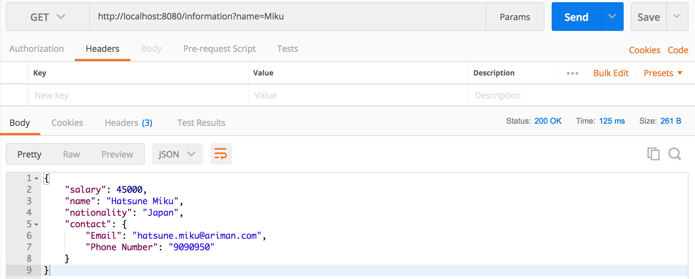
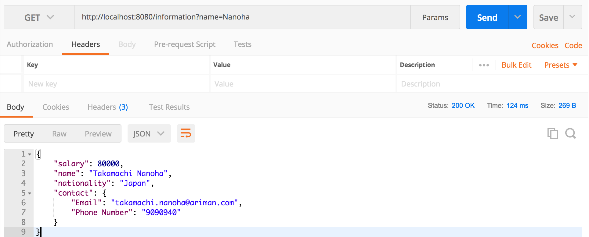
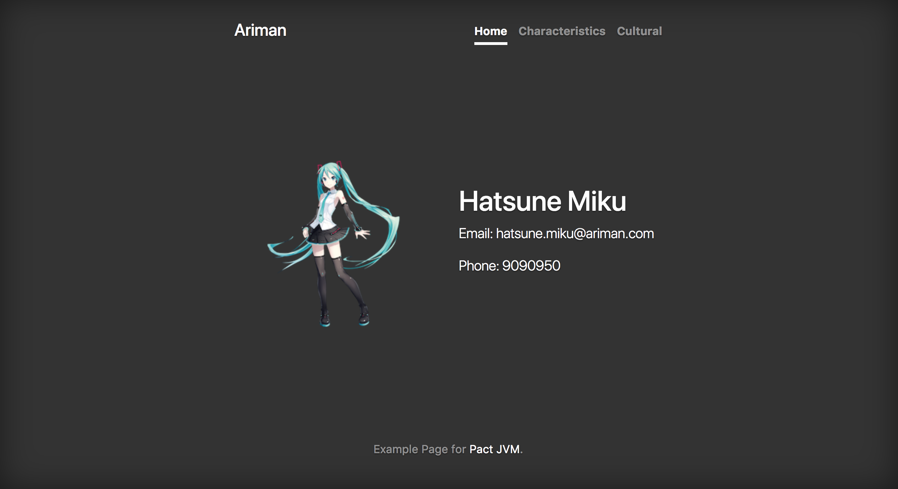
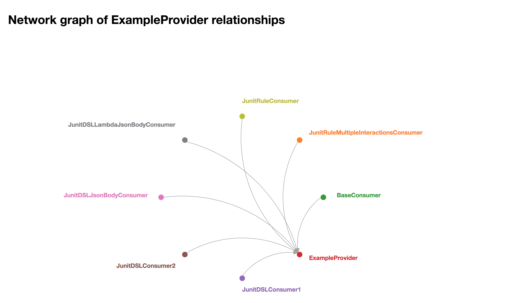

如今，契约测试已经逐渐成为测试圈中一个炙手可热的话题，特别是在微服务大行其道的行业背景下，越来越多的团队开始关注服务之间的契约及其契约测试。

从2016年开始我就在Thoughtworks和QA Community里推广契约测试，收到了不错的成效，期间有不少同学和我讨论过如何上手契约测试，发现网上介绍契约测试的讲义、博客不乏其数（当然，质量也参差不齐），可手把手教你写契约测试的文章却几乎没有，原因恐怕就是契约测试的特性吧。契约测试是架设在消费者和服务者之间的一种比较特殊的测试活动，如果你只是想自己学习而又没有合适的项目环境，那你得自己先准备适当的消费者和服务者程序源代码，然后再开始写契约测试，而不是像写个Selenium测试那样，两三行代码就可以随随便便地调戏度娘。～(￣▽￣～)

所以，我花了些时间磨叽出了这片文章……

本文不会涉及契约测试的基本概念，因为相应的文章网上太多了，请大家自己去捞吧。本文也不会讨论契约测试的使用场景以及对其的正确理解，这方面的话题我会在今后另文介绍（好吧，我承认我很懒ㄟ(▔,▔)ㄏ）。

---

OK，以下开始正文！

契约测试的精髓在于消费者驱动，实践消费者驱动契约测试的工具主要有Pact，Pacto 和 Spring Cloud Contract，其中Pact是目前最为推荐的，我下面的例子都将使用Pact来练习。[Pact](https://docs.pact.io/)最早是用Ruby实现的，目前已经扩展支撑Java，.NET，Javascript，Go，Swift，Python和PHP，其中[Java（JVM）](https://github.com/DiUS/pact-jvm)是我们目前项目中使用最频繁的，所以我的例子亦都是基于PACT JVM来实现（观众A:我们都用Pyhton，你丫给我说Java(╯°□°）╯︵┻━┻）

## 示例源码
大家可以从Github上获取本文示例的[源码](https://github.com/Mikuu/Pact-JVM-Example)，也可以从PACT JVM官网上面找到对应的PACT-JVM-Example[链接](https://github.com/DiUS/pact-jvm#links)

## 示例应用
示例应用非常简单，一个服务提供者Provider，两个服务消费者Miku和Nanoha（啥？你不知道Miku和Nanoha是什么？......问度娘吧......(～o￣3￣)～......）。
### Provider
Provider是一个简单的API，返回一些个人信息。
启动Provider：
```commandline
./gradlew :example-provider:bootRun
```
然后访问 http://localhost:8080/information?name=Miku


或者访问 http://localhost:8080/information?name=Nanoha


### 消费者 Miku & Nanoha
Miku和Nanoha调用Provider的API拿到各自的数据，然后显示在前端页面上。
启动Miku：
```commandline
./gradlew :example-consumer-miku:bootRun
```
然后用浏览器访问 http://localhost:8081/miku


启动Nanoha：
```commandline
./gradlew :example-consumer-nanoha:bootRun
```
然后用浏览器访问 http://localhost:8082/nanoha


Miku和Nanoha做的事情基本一样，差别就是Nanoha会去多拿`.nationality`这个字段，而`.salary`这个字段Miku和Nanoha都没有用到。

> 示例中的1个Provider和2个Consumer都在一个codebase里面，这只是为了方便管理示例代码，而实际的项目中，绝大多数的Provider和Consumer都是在不同的codebase里面管理的，请注意哟！

## Provider与Miku间的契约测试
好了，大概了解示例应用之后，我们就可以开始写契约测试了（当然，如果你还想再撩撩示例的源码，也是可以的啦，不过相信我，里面没多少油水的）

我们先从Provider和Miku`之间`的契约测试开始。
> 请注意"之间"这个关键词，当我们谈论契约测试时，一定要明确它是建立在某一对Provider和Consumer之间的测试活动。没有Provider，Consumer做不了契约测试；没有Consumer，Provider不需要做契约测试。

###编写消费者Miku端的测试案例
目前，PACT JVM在消费者端的契约测试主要有三种写法：
* 基本的Junit
* Junit Rule
* Junit DSL

它们都能完成消费者端契约文件的生成，只是写法有所不同，带来的代码简洁度和部分功能有些许差异。
> 所有的契约测试代码都已经写好了，你可以在`src/test/java/ariman/pact/consumer`下面找到。

#### 基本的Junit
“talk is cheap, show you the code”

`PactBaseConsumerTest.java`

```java
public class PactBaseConsumerTest extends ConsumerPactTestMk2 {

    @Override
    @Pact(provider="ExampleProvider", consumer="BaseConsumer")
    public RequestResponsePact createPact(PactDslWithProvider builder) {
        Map<String, String> headers = new HashMap<String, String>();
        headers.put("Content-Type", "application/json;charset=UTF-8");

        return builder
                .given("")
                .uponReceiving("Pact JVM example Pact interaction")
                .path("/information")
                .query("fullName=Miku")
                .method("GET")
                .willRespondWith()
                .headers(headers)
                .status(200)
                .body("{\n" +
                        "    \"salary\": 45000,\n" +
                        "    \"fullName\": \"Hatsune Miku\",\n" +
                        "    \"nationality\": \"Japan\",\n" +
                        "    \"contact\": {\n" +
                        "        \"Email\": \"hatsune.miku@ariman.com\",\n" +
                        "        \"Phone Number\": \"9090950\"\n" +
                        "    }\n" +
                        "}")

                .toPact();
    }

    @Override
    protected String providerName() {
        return "ExampleProvider";
    }

    @Override
    protected String consumerName() {
        return "BaseConsumer";
    }

    @Override
    protected void runTest(MockServer mockServer) throws IOException {
        ProviderHandler providerHandler = new ProviderHandler();
        providerHandler.setBackendURL(mockServer.getUrl());
        Information information = providerHandler.getInformation();
        assertEquals(information.getName(), "Hatsune Miku");
    }
}
```
这里的关键是`createPact`和`runTest`这两个方法：
* `createPact`直接定义了契约交互的全部内容，比如Request的路径和参数，以及返回的Response的具体内容；
* `runTest`是执行测试的方法，其中`ProviderHandler`是Miku应用代码中的类，我们直接使用它来发送真正的Request，发给谁呢？发给`mockServer`，Pact会启动一个mockServer, 基于Java原生的HttpServer封装，用来代替真正的Provider应答`createPact`中定义好的响应内容，继而模拟了整个契约的内容；
* runTest中的断言可以用来保证我们编写的契约内容是符合Miku期望的，你可以把它理解为一种类似Consumer端的集成测试；

#### Junit Rule

`PactJunitRuleTest.java`

```java
public class PactJunitRuleTest {

    @Rule
    public PactProviderRuleMk2 mockProvider = new PactProviderRuleMk2("ExampleProvider",this);

    @Pact(consumer="JunitRuleConsumer")
    public RequestResponsePact createPact(PactDslWithProvider builder) {
        Map<String, String> headers = new HashMap<String, String>();
        headers.put("Content-Type", "application/json;charset=UTF-8");

        return builder
                .given("")
                .uponReceiving("Pact JVM example Pact interaction")
                .path("/information")
                .query("fullName=Miku")
                .method("GET")
                .willRespondWith()
                .headers(headers)
                .status(200)
                .body("{\n" +
                        "    \"salary\": 45000,\n" +
                        "    \"fullName\": \"Hatsune Miku\",\n" +
                        "    \"nationality\": \"Japan\",\n" +
                        "    \"contact\": {\n" +
                        "        \"Email\": \"hatsune.miku@ariman.com\",\n" +
                        "        \"Phone Number\": \"9090950\"\n" +
                        "    }\n" +
                        "}")
                .toPact();
    }

    @Test
    @PactVerification
    public void runTest() {
        ProviderHandler providerHandler = new ProviderHandler();
        providerHandler.setBackendURL(mockProvider.getUrl());
        Information information = providerHandler.getInformation();
        assertEquals(information.getName(), "Hatsune Miku");
    }
}
```
相较于基本的Junit写法，`PactProviderRuleMk2`能够让代码更加的简洁，它还可以自定义Mock Provider的address和port。如果像上面的代码一样省略address和port，则会默认使用127.0.0.1和随机端口。Junit Rule还提供了方法让你可以同时对多个Provider进行测试，以及让Mock Provider使用HTTPS进行交互。

>基于体力有限，本示例没有包含MultiProviders和HTTPS的例子，有需要的同学可以在PACT JVM官网上查询相关的用法......别，别打呀，俺承认，俺就是懒...还打...#$%^&*!@#$%^&...喂：110吗？俺要报警......

#### Junit DSL
`PactJunitDSLTest`

```java
public class PactJunitDSLTest {

    private void checkResult(PactVerificationResult result) {
        if (result instanceof PactVerificationResult.Error) {
            throw new RuntimeException(((PactVerificationResult.Error)result).getError());
        }
        assertEquals(PactVerificationResult.Ok.INSTANCE, result);
    }

    @Test
    public void testPact1() {
        Map<String, String> headers = new HashMap<String, String>();
        headers.put("Content-Type", "application/json;charset=UTF-8");

        RequestResponsePact pact = ConsumerPactBuilder
            .consumer("JunitDSLConsumer1")
            .hasPactWith("ExampleProvider")
            .given("")
            .uponReceiving("Query fullName is Miku")
                .path("/information")
                .query("fullName=Miku")
                .method("GET")
            .willRespondWith()
                .headers(headers)
                .status(200)
                .body("{\n" +
                        "    \"salary\": 45000,\n" +
                        "    \"fullName\": \"Hatsune Miku\",\n" +
                        "    \"nationality\": \"Japan\",\n" +
                        "    \"contact\": {\n" +
                        "        \"Email\": \"hatsune.miku@ariman.com\",\n" +
                        "        \"Phone Number\": \"9090950\"\n" +
                        "    }\n" +
                        "}")
            .toPact();

        MockProviderConfig config = MockProviderConfig.createDefault();
        PactVerificationResult result = runConsumerTest(pact, config, mockServer -> {
            ProviderHandler providerHandler = new ProviderHandler();
            providerHandler.setBackendURL(mockServer.getUrl(), "Miku");
            Information information = providerHandler.getInformation();
            assertEquals(information.getName(), "Hatsune Miku");
        });

        checkResult(result);
    }

    @Test
    public void testPact2() {
        Map<String, String> headers = new HashMap<String, String>();
        headers.put("Content-Type", "application/json;charset=UTF-8");

        RequestResponsePact pact = ConsumerPactBuilder
            .consumer("JunitDSLConsumer2")
            .hasPactWith("ExampleProvider")
            .given("")
            .uponReceiving("Query fullName is Nanoha")
                .path("/information")
                .query("fullName=Nanoha")
                .method("GET")
            .willRespondWith()
                .headers(headers)
                .status(200)
                .body("{\n" +
                        "    \"salary\": 80000,\n" +
                        "    \"fullName\": \"Takamachi Nanoha\",\n" +
                        "    \"nationality\": \"Japan\",\n" +
                        "    \"contact\": {\n" +
                        "        \"Email\": \"takamachi.nanoha@ariman.com\",\n" +
                        "        \"Phone Number\": \"9090940\"\n" +
                        "    }\n" +
                        "}")
                .toPact();

        MockProviderConfig config = MockProviderConfig.createDefault();
        PactVerificationResult result = runConsumerTest(pact, config, mockServer -> {
            ProviderHandler providerHandler = new ProviderHandler();
            providerHandler.setBackendURL(mockServer.getUrl(), "Nanoha");

            Information information = providerHandler.getInformation();
            assertEquals(information.getName(), "Takamachi Nanoha");
        });

        checkResult(result);
    }
}
```

基本的Junit和Junit Rule的写法只能在一个测试文件里面写一个Test Case，而使用Junit DSL则可以像上面的例子一样写多个Test Case。同样，你也可以通过`MockProviderConfig.createDefault()`配置Mock Server的address和port。上面的例子使用了默认配置。

`PactJunitDSLJsonBodyTest`

```java
public class PactJunitDSLJsonBodyTest {
    PactSpecVersion pactSpecVersion;

    private void checkResult(PactVerificationResult result) {
        if (result instanceof PactVerificationResult.Error) {
            throw new RuntimeException(((PactVerificationResult.Error)result).getError());
        }
        assertEquals(PactVerificationResult.Ok.INSTANCE, result);
    }

    @Test
    public void testWithPactDSLJsonBody() {
        Map<String, String> headers = new HashMap<String, String>();
        headers.put("Content-Type", "application/json;charset=UTF-8");

        DslPart body = new PactDslJsonBody()
                .numberType("salary", 45000)
                .stringType("fullName", "Hatsune Miku")
                .stringType("nationality", "Japan")
                .object("contact")
                .stringValue("Email", "hatsune.miku@ariman.com")
                .stringValue("Phone Number", "9090950")
                .closeObject();

        RequestResponsePact pact = ConsumerPactBuilder
            .consumer("JunitDSLJsonBodyConsumer")
            .hasPactWith("ExampleProvider")
            .given("")
            .uponReceiving("Query fullName is Miku")
                .path("/information")
                .query("fullName=Miku")
                .method("GET")
            .willRespondWith()
                .headers(headers)
                .status(200)
                .body(body)
            .toPact();

        MockProviderConfig config = MockProviderConfig.createDefault(this.pactSpecVersion.V3);
        PactVerificationResult result = runConsumerTest(pact, config, mockServer -> {
            ProviderHandler providerHandler = new ProviderHandler();
            providerHandler.setBackendURL(mockServer.getUrl());
            Information information = providerHandler.getInformation();
            assertEquals(information.getName(), "Hatsune Miku");
        });

        checkResult(result);
    }
    @Test
    public void testWithLambdaDSLJsonBody() {
        Map<String, String> headers = new HashMap<String, String>();
        headers.put("Content-Type", "application/json;charset=UTF-8");

        DslPart body = newJsonBody((root) -> {
            root.numberValue("salary", 45000);
            root.stringValue("fullName", "Hatsune Miku");
            root.stringValue("nationality", "Japan");
            root.object("contact", (contactObject) -> {
                contactObject.stringMatcher("Email", ".*@ariman.com", "hatsune.miku@ariman.com");
                contactObject.stringType("Phone Number", "9090950");
            });
        }).build();

        RequestResponsePact pact = ConsumerPactBuilder
            .consumer("JunitDSLLambdaJsonBodyConsumer")
            .hasPactWith("ExampleProvider")
            .given("")
            .uponReceiving("Query fullName is Miku")
                .path("/information")
                .query("fullName=Miku")
                .method("GET")
            .willRespondWith()
                .headers(headers)
                .status(200)
                .body(body)
            .toPact();

        MockProviderConfig config = MockProviderConfig.createDefault(this.pactSpecVersion.V3);
        PactVerificationResult result = runConsumerTest(pact, config, mockServer -> {
            ProviderHandler providerHandler = new ProviderHandler();
            providerHandler.setBackendURL(mockServer.getUrl());
            Information information = providerHandler.getInformation();
            assertEquals(information.getName(), "Hatsune Miku");
        });

        checkResult(result);
    }

}
```

当然，Junit DSL的强大之处绝不仅仅是让你多写几个Test Case， 通过使用PactDslJsonBody和Lambda DSL你可以更好的编写你的契约测试文件：
* 对契约中Response Body的内容，使用JsonBody代替简单的字符串，可以让你的代码易读性更好；
* JsonBody提供了强大的Check By Type和Check By Value的功能，让你可以控制对Provider的Response测试精度。比如，对于契约中的某个字段，你是要确保Provider的返回必须是具体某个数值（check by Value），还是只要数据类型相同就可以（check by type），比如都是String或者Int。你甚至可以直接使用正则表达式来做更加灵活的验证；
* 目前支持的匹配验证方法：

| method | description |
|--------|-------------|
| string, stringValue | Match a string value (using string equality) |
| number, numberValue | Match a number value (using Number.equals)\* |
| booleanValue | Match a boolean value (using equality) |
| stringType | Will match all Strings |
| numberType | Will match all numbers\* |
| integerType | Will match all numbers that are integers (both ints and longs)\* |
| decimalType | Will match all real numbers (floating point and decimal)\* |
| booleanType | Will match all boolean values (true and false) |
| stringMatcher | Will match strings using the provided regular expression |
| timestamp | Will match string containing timestamps. If a timestamp format is not given, will match an ISO timestamp format |
| date | Will match string containing dates. If a date format is not given, will match an ISO date format |
| time | Will match string containing times. If a time format is not given, will match an ISO time format |
| ipAddress | Will match string containing IP4 formatted address. |
| id | Will match all numbers by type |
| hexValue | Will match all hexadecimal encoded strings |
| uuid | Will match strings containing UUIDs |
| includesStr | Will match strings containing the provided string |
| equalsTo | Will match using equals |
| matchUrl | Defines a matcher for URLs, given the base URL path and a sequence of path fragments. The path fragments could be strings or regular expression matchers |

* 对于Array和Map这样的数据结构，DSL也有相应匹配验证方法，我这里就不罗列了，请参考[官网的介绍](https://github.com/DiUS/pact-jvm/tree/master/pact-jvm-consumer-junit#user-content-ensuring-all-items-in-a-list-match-an-example-220)；

### 执行Miku端的测试
Test Case准备好后，我们就可以执行测试了。因为我们实际上是用的Junit的框架，所以和执行一般的单元测试是一样的：
```commandline
./gradlew :example-consumer-miku:clean test
```
成功执行后，你就可以在`Pacts\Miku`下面找到所有测试生成的契约文件。

### 发布契约文件到Pact Broker
契约文件，也就是`Pacts\Miku`下面的那些JSON文件，可以用来驱动Provider端的契约测试。由于我们的示例把Consumer和Provider都放在了同一个Codebase下面，所以`	Pacts\Miku`下面的契约文件对Provider是直接可见的，而真实的项目中，往往不是这样，你需要通过某种途径把契约文件从Consumer端发送给Provider端。你可以选择把契约文件SCP到Provider的测试服务器去，也可以选择使用中间文件服务器来共享契约文件，你甚至可以直接人肉发邮件把契约文件扔给Provider的团队，然后告诉他们“这是我们的契约，你们看着办吧~”（当然，这样很Low ...），这些都是可行的。显然，Pact提供了更加优雅的方式，那就是使用[Pact Broker](https://github.com/pact-foundation/pact_broker)。

当你准备好Broker后，就可以用它来方便的实现真正的消费者驱动的契约测试了。
> 好吧，我得承认，“准备”这两个字我用得有些轻描淡写，实际的情况是你可能需要费一番周折才能弄好一个Broker服务。目前有好些方法可以搭建Broker服务，你可以直接下载官网的源码然后自己折腾，也可以使用Docker来个一键了事，更可以直接找Pact官方申请一个公共的Broker，当然，那样做就得暴露你的契约给第三方服务器，真实的产品项目多半是不行的，但如果只是学习，那就事半功倍了，比如我们当前的这个示例就是如此。

将契约文件上传到Broker服务器非常简单：
```commandline
./gradlew :example-consumer-miku:pactPublish
```
然后你会在命令行下面看到类似这样的输出：
```commandline
> Task :example-consumer-miku:pactPublish 
Publishing JunitDSLConsumer1-ExampleProvider.json ... HTTP/1.1 200 OK
Publishing JunitDSLJsonBodyConsumer-ExampleProvider.json ... HTTP/1.1 200 OK
Publishing JunitDSLLambdaJsonBodyConsumer-ExampleProvider.json ... HTTP/1.1 200 OK
Publishing BaseConsumer-ExampleProvider.json ... HTTP/1.1 200 OK
Publishing JunitRuleConsumer-ExampleProvider.json ... HTTP/1.1 200 OK
Publishing JunitRuleMultipleInteractionsConsumer-ExampleProvider.json ... HTTP/1.1 200 OK
Publishing JunitDSLConsumer2-ExampleProvider.json ... HTTP/1.1 200 OK
```
上传完成之后，你就可以在我们的[Broker服务器](https://ariman.pact.dius.com.au/)上面看到对于的契约内容了。

> 值得说明的是，你可以看到上面我们有7个Consumer对应1个Provdier。在真实的项目中，不应该是这样的，因为现在我们实际上只有一个Consumer Miku。我只是在不同的契约文件中对Consumer的名字做了不同的命名，目的只是展示一下Broker的这个漂亮的调用关系图。这只是一个示例，仅此而已。

至此，Pact测试中，Consumer端的工作我们就全部搞定了，剩下的就是Provider的活了。

### Provider端的测试
在Provider端，我们使用Gradle的Plugin来执行契约测试，非常的简单，不需要写一行测试代码：
```commandline
./gradlew :example-provider:pactVerify
```
> 在Provider端执行契约测试之前，我们需要先启动Provider的应用。虽然通过gradle我们可以配置自动关停应用，但对于初学者，我还是建议大家多手动捣鼓捣鼓，不然你都不知道这个测试是怎么个跑法。啥？不知道怎么启动Provider？自己去本文的开头部分找去 ...

然后，你可以在命令行下面看到类似这样的输出：
```commandline
Arimans-MacBook-Pro:pact-jvm-example ariman$ ./gradlew :example-provider:pactVerify

> Task :example-provider:pactVerify_ExampleProvider

Verifying a pact between Miku - Base contract and ExampleProvider
  [Using File /Users/ariman/Workspace/Pacting/pact-jvm-example/Pacts/Miku/BaseConsumer-ExampleProvider.json]
  Given
         WARNING: State Change ignored as there is no stateChange URL
  Consumer Miku
    returns a response which
      has status code 200 (OK)
      includes headers
        "Content-Type" with value "application/json;charset=UTF-8" (OK)
      has a matching body (OK)
  Given
         WARNING: State Change ignored as there is no stateChange URL
  Pact JVM example Pact interaction
    returns a response which
      has status code 200 (OK)
      includes headers
        "Content-Type" with value "application/json;charset=UTF-8" (OK)
      has a matching body (OK)

  ...

  Verifying a pact between JunitRuleMultipleInteractionsConsumer and ExampleProvider
    [from Pact Broker https://ariman.pact.dius.com.au/pacts/provider/ExampleProvider/consumer/JunitRuleMultipleInteractionsConsumer/version/1.0.0]
    Given
           WARNING: State Change ignored as there is no stateChange URL
    Miku
      returns a response which
        has status code 200 (OK)
        includes headers
          "Content-Type" with value "application/json;charset=UTF-8" (OK)
        has a matching body (OK)
    Given
           WARNING: State Change ignored as there is no stateChange URL
    Nanoha
      returns a response which
        has status code 200 (OK)
        includes headers
          "Content-Type" with value "application/json;charset=UTF-8" (OK)
        has a matching body (OK)

```
从上面的结果可以看出，我们的测试既使用了来自本地的契约文件，也使用了来自Broker的契约文件。
> 由于我们示例使用的Broker服务器是公共的，任何调戏我们这个示例应用的小伙伴都能上传他们自己的契约文件，其中难免会存在错误的契约。所以，如果你发现来自Broker的契约让你的测试挂掉了，请不要惊慌哟。当然，因为是公共服务器，我会不定时的清空里面的契约文件，所以哪天你要是发现你之前上传的契约文件没有了，也不必大惊小怪。

## 相关的Gradle配置
OK，Provider和Miku感情故事我们就讲完了。在讲Nanoha之前，先让我们来看看Gradle的一些配置内容：
```groovy
project(':example-consumer-miku') {
    ...
    test {
        systemProperties['pact.rootDir'] = "$rootDir/Pacts/Miku"
    }

    pact {
            publish {
                pactDirectory = "$rootDir/Pacts/Miku"
                pactBrokerUrl = mybrokerUrl
                pactBrokerUsername = mybrokerUser
                pactBrokerPassword = mybrokerPassword
            }
    }
    ...
}


project(':example-consumer-nanoha') {
    ...
    test {
        systemProperties['pact.rootDir'] = "$rootDir/Pacts/Nanoha"
    }
    ...
}

import java.net.URL

project(':example-provider') {
    ...
    pact {
            serviceProviders {
                ExampleProvider {
                    protocol = 'http'
                    host = 'localhost'
                    port = 8080
                    path = '/'

                    // Test Pacts from local Miku
                    hasPactWith('Miku - Base contract') {
                        pactSource = file("$rootDir/Pacts/Miku/BaseConsumer-ExampleProvider.json")
                    }

                    hasPactsWith('Miku - All contracts') {
                        pactFileLocation = file("$rootDir/Pacts/Miku")
                    }

                    // Test Pacts from Pact Broker
                    hasPactsFromPactBroker(mybrokerUrl, authentication: ['Basic', mybrokerUser, mybrokerPassword])

                    // Test Pacts from local Nanoha
    //                hasPactWith('Nanoha - With Nantionality') {
    //                    pactSource = file("$rootDir/Pacts/Nanoha/ConsumerNanohaWithNationality-ExampleProvider.json")
    //                }

    //                hasPactWith('Nanoha - No Nantionality') {
    //                    stateChangeUrl = new URL('http://localhost:8080/pactStateChange')
    //                    pactSource = file("$rootDir/Pacts/Nanoha/ConsumerNanohaNoNationality-ExampleProvider.json")
    //                }
                }
            }
        }
    }
```
Gradle的配置也是非常的简单的，Provider，Miku和Nanoha作为三个单独的应用，都是独立配置的，其中的一些关键信息：
- `systemProperties['pact.rootDir']` 指定了我们生存契约文件的路径；
- Miku中的`pact { ... }`定义了我们Pact Broker的服务器地址，以及我们访问时需要的认证信息。PS，如果你想通过浏览器访问Broker，比如看上面的关系图，你也是需要这个认证信息的。这里的配置使用的是变量，真正的用户名和密码在哪儿？不告诉你，自己找找吧(￣▽￣)~*
- Provider的`hasPactWith()`和`hasPactsWith()`指定了执行`PactVerify`时会去搜索的本地路径，相应的，`hasPactsFromPactBroker`则是指定了Broker的服务器地址；
- *为什么要注释掉Nanoha的契约文件路径呢？因为目前我们还没有生成Nanoha的契约文件，如果不注释掉它们的话，测试会报找不到文件的错误。我们可以在之后生成完Nanoha的契约文件后，再打开注释；

## Provider与Nanoha间的契约测试

## 验证我们的测试


