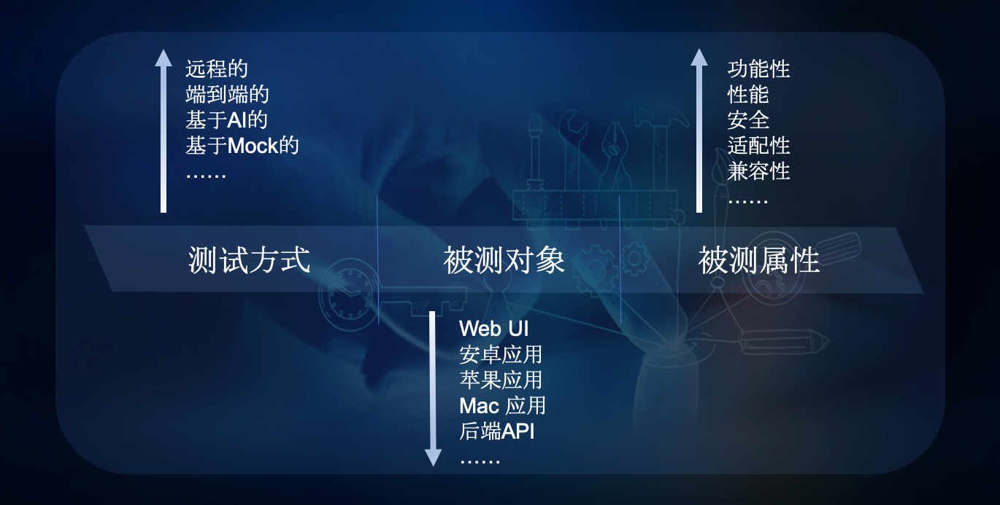
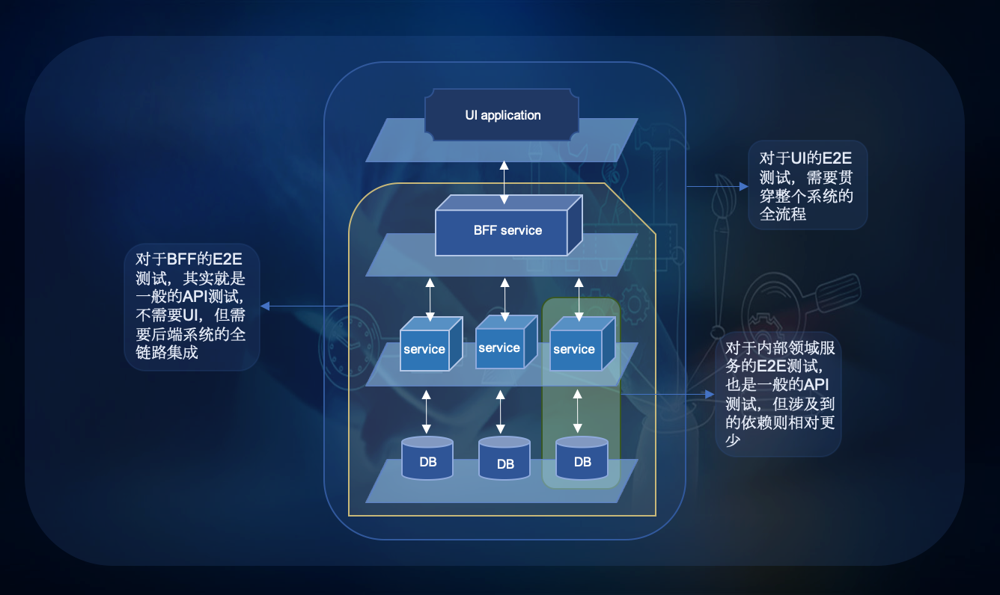

# xxxxxxxxxxxxxxxxx

在之前写的《契约测试之Pact By Example》中，我曾提到会再写一篇文章，来聊聊如何正确地认识和理解契约测试（好吧，至少是我认为的"正确地"）。
但在随后的一年多时间里，对契约测试的讨论渐渐淡出了我的视野。我的理解是，随着微服务的大行其道，契约测试作为带刀护卫，已经深入人心了，所以没必
要再去炒这碗冷饭，就像现在已经没有谁会再来码字吹Selenium一样（...请相信，我一定不是因为懒才这么说的o(\*￣3￣)o）。

然而，在最近参加的一次面向Dev的后端分享的讨论中，我意外的发现，契约测试作为构建微服务重要的一环工程实践，虽然确实已经被团队原生接受，但对于
契约测试的理解，还存在一些认识上的盲点，特别是当契约测试与集成测试、接口测试一起讨论的时候，理解的偏差往往会被放大不少。所以，我想必要的码点
字，分享一下我对契约测试的理解，还是有益的。

"契约测试，是建立在服务的消费者和生产者之间的......"(此处省略废话N多字)，如果您要继续看下去，请注意一下：
* 以下的内容不会涉及基本的契约测试概念，比如消费者、生产者、契约、消费者驱动等等，如果您对这些基本概念还不是很清楚，建议您可以花点儿时间先
google一下，当然，Pact的[官方文档](https://docs.pact.io/terminology)可以是一个很好的开始；
* 以下的内容不会涉及具体的契约测试编写和执行步骤，相关的内容，您可以参看我之前的文章《契约测试之Pact By Example》；
* 如果您之前在任何地方、通过任何方式，看到过一些我对契约测试的观点的分享，并且觉得我就是在胡说八道，那您也不用看下去了，因为后面都是胡说十六
道，而已；

## 关于测试的表述
在聊契约测试之前，让我们先来说一些平时看似毫不起眼的小话题---"测试的表述"。

> "我们可以在E2E测试中覆盖这个场景，而不是单元测试..."

或者

> "你们的E2E测试是怎么做的？..."

这里的`E2E测试`可能经常出现在我们的日常交流中，那你知道它的准确含义吗？答案是没有含义！它基本等价于你们一伙人去食堂吃饭（...笑啥，俺就是食
堂党，咋的！），A："今天吃啥？"，B："新鲜的"。新鲜的啥？炒饭？面条？饺子？套餐？...... 

E2E，End To End，端到端，字面意思简单明了，但它只是一个副词（组），而不是一种测试类型。所以，我们真正想表述的，可能是E2E API Test。那么
"E2E API Test"就完整的表述了一项测试活动了吗？不是的！`E2E`表示的是测试方式，`API`表示的是被测对象，但这里，我们还缺少被测对象的被测属性，
比如，Function、Performance, Security等等，所以，一个比较完整的表述，往往可以是这样的：

当然，平常的交流中，一般不会这么文绉绉地去抠字眼，因为我们彼此都清楚讨论问题的上下文，这点很重要。特别是针对`E2E测试`这样的表述。比如，我们
有一个前后端分离、后端是微服务集群的系统应用，同样的`E2E测试`可能就代表着完全不同的测试活动：

如果从更多的维度来思考，比如套上测试四象限的模式，那么对于测试活动的表述，还会有更多考量。但今天的主题是关于契约测试的，所以就不过多的展开了。
为什么要在讨论契约测试之前来废话"测试表述"呢？因为契约测试其实是多种测试方式的和思维的复合产物，比如，契约测试是E2E的测试吗？还是说是基于
Mock的？契约测试是服务的接口测试还是集成测试？等等。所以，如果对这些基本的测试概念不是很清楚的，很容易迷失在契约测试的理念中。

## 为什么要做契约测试？
为什么要做契约测试？"因为我们是微服务"？(╬￣皿￣)=○

很多回答这个问题的答案，都关注在契约测试的目的上。那么，什么是契约测试的目的呢？简单来说，契约测试就是为了发现契约破坏（Contract Breaking)
而进行的测试活动。如果你使用过Pact或者Spring Cloud Contract，你会发现，契约测试本身也是通过调用Provider的API接口来获取Response，再与
契约文件中期望的结果做对比，从而验证契约是否正确。形式上，这和我们的API接口测试，或者针对功能的集成测试（以下简称集成测试，因为我们这里不讨
论API的安全、性能等问题）是非常类似的。换句话说，我们通过API的接口测试或者集成测试，也能达到检查契约的目的，那为什么还要做契约测试呢？这种
思考逻辑是完全正确的，也是为什么很多初学者都认为契约测试没有必要的原因。

那再问，为什么我们还要做契约测试呢？真正能够回答这个问题的，不是契约测试的目的，而是契约测试可以带来的价值！

### 契约测试的价值
那什么是契约测试的价值呢？

## 契约测试和接口测试、集成测试的区别

## 契约测试可以替代集成测试吗？

## 关于Pact和Spring Cloud Contract

